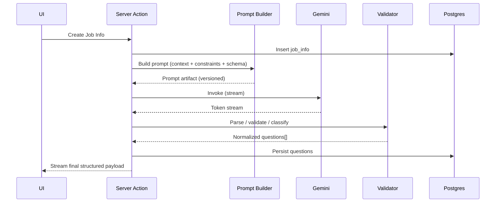
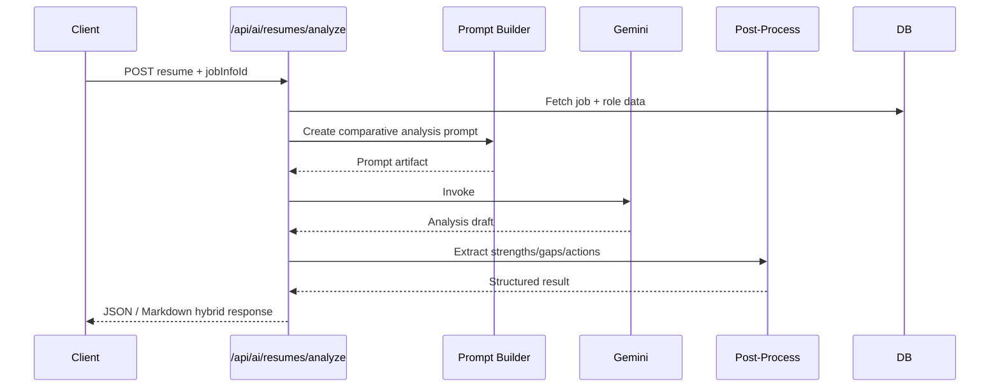
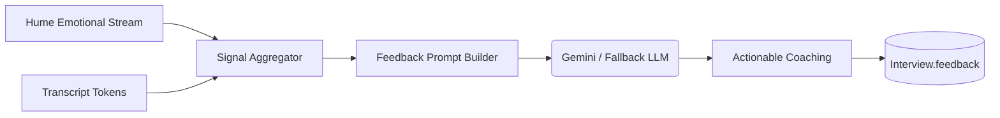
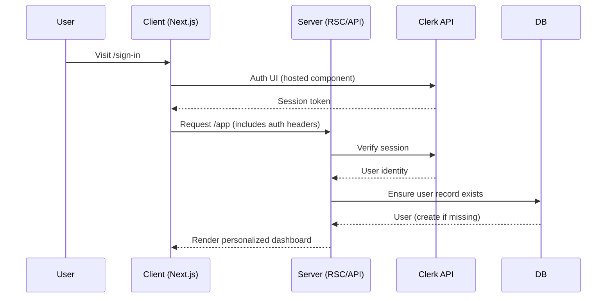
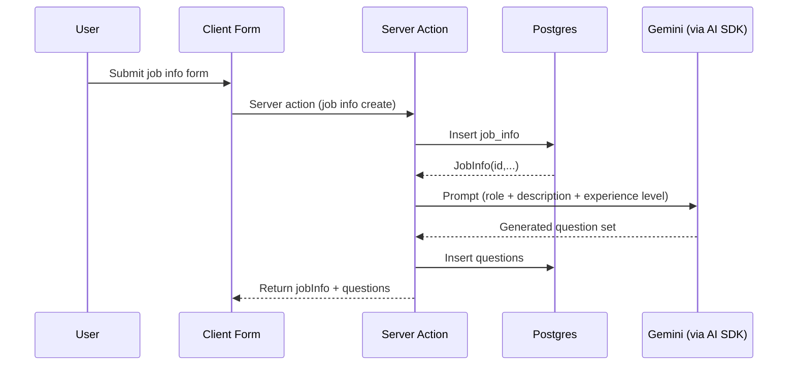
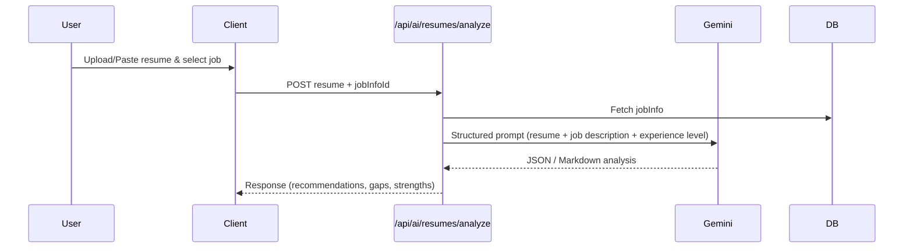
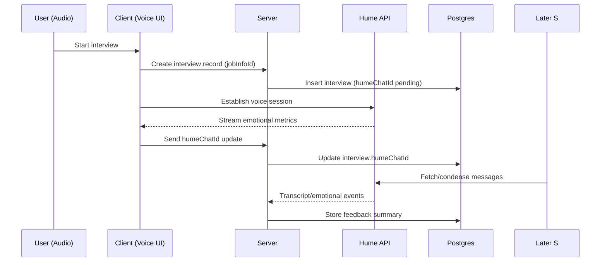

## AI Powered Job Prep – System Architecture (AI-Focused)

_Last updated: 2025-09-13_

This revision emphasizes the AI/ML aspects: model orchestration, prompt engineering strategy, safety, governance, and extensibility. Non-AI platform layers are summarized for context.

---

## 1. AI-Centric Executive Summary

The platform applies multi-source intelligence to accelerate interview preparation:

1. **Structured Job Context Ingestion** → Normalizes role, experience level, description.
2. **Question Generation Pipeline** → Uses Gemini (via Vercel AI SDK) to synthesize difficulty-tiered questions.
3. **Adaptive Interview Sessions** → Hume emotional & vocal signals augment textual generation for feedback.
4. **Resume–Job Fit Analysis** → Comparative reasoning prompt surfaces gaps, strengths, actionable improvements.
5. **Pluggable Model Layer** → Unified abstraction enables future multi-provider, fallback, or ensemble strategies.

Strategic AI Principles:

- Deterministic scaffolding (schema + zod validation) before stochastic generation.
- Separation of prompt templates from execution logic for governance & versioning.
- Progressive enrichment: user data → normalized domain object → structured prompt → model response → post-process (validation / sanitization) → persistence / display.
- Safety & cost controls (planned): caching, token metering, output linting, provider fallback.

---

## 2. AI Layer Deep Dive

### 2.1 Components

| Component              | Location                               | Purpose                                                                       |
| ---------------------- | -------------------------------------- | ----------------------------------------------------------------------------- |
| Prompt Builders        | `src/services/ai/*`                    | Domain-specific assembly of contextual inputs into structured prompt blocks.  |
| Model Adapters         | Vercel AI SDK (`ai`, `@ai-sdk/google`) | Abstract provider differences; enable streaming & future multi-model support. |
| Emotional Intelligence | `@humeai/voice-react`, `hume`          | Real-time voice + affect signals to enrich interview feedback.                |
| Post-Processors        | (Inline today)                         | Normalize model output (Markdown → HTML, difficulty mapping).                 |
| Persistence Layer      | Drizzle ORM                            | Stores derived entities (questions, interviews, feedback).                    |
| Validation             | `zod`                                  | Guards inputs (resume text length, job description) & output shape (future).  |

### 2.2 Prompt Engineering Strategy

Current: Direct composition of domain data into a single structured prompt per task.

Proposed Enhancements:

- **Template Versioning**: `PROMPT_VERSION` constant stored with outputs for reproducibility.
- **Sectional Prompts**: Split into: Context, Constraints, Output Schema, Examples.
- **Few-Shot Examples**: Provide 2–3 curated Q&A patterns per experience level to stabilize style.
- **Output Schema Hints**: Encourage JSON envelope (e.g. `{questions: [...], meta: {...}}`) for machine parsing.
- **Guard Rails**: Add explicit instructions: “If insufficient info, respond with NEED_MORE_INFO.”

### 2.3 Pipeline Pattern (Future Standardization)

```mermaid
flowchart LR
  Raw[User / Domain Input] --> Normalize[Normalize / Validate]
  Normalize --> Template[Prompt Template Render]
  Template --> Call[Model Call]
  Call --> Parse[Parse / Validate Output]
  Parse --> Enhance[Enrichment (difficulty tagging, dedupe)]
  Enhance --> Persist[Persist / Cache]
  Persist --> Deliver[Stream / Return to Client]
  Call -. Fallback .-> Fallback[(Alt Provider)]
  Parse -. OnError .-> Recovery[Recovery / Retry]
```

### 2.4 Hume Integration Role

- Adds affective computing dimension: emotional tone, engagement, pacing.
- Feedback synthesis can merge: (a) transcript semantics (Gemini) + (b) affect metrics (Hume) → richer coaching.
- Future: feed summarized affect metrics back into adaptive question difficulty.

### 2.5 Multi-Provider & Fallback Strategy (Planned)

| Scenario                | Primary    | Fallback               | Logic                                                 |
| ----------------------- | ---------- | ---------------------- | ----------------------------------------------------- |
| Latency Spike           | Gemini Pro | Cached previous result | Use cached hash if identical inputs < TTL.            |
| Provider Error          | Gemini Pro | Secondary LLM          | Retry with downgraded creativity (lower temperature). |
| Cost Threshold Exceeded | Gemini Pro | Local heuristic        | Provide static template guidance.                     |

### 2.6 Output Quality Enhancements

- Deduplicate similar questions via semantic hashing (token set / min edit distance).
- Difficulty balancing: enforce distribution rule (e.g., 40% medium, 30% hard, 30% easy).
- Resume analysis: highlight diff between required vs present skills (planned skill taxonomy extraction step).

### 2.7 Model Governance & Observability (Planned)

| Aspect              | Mechanism                                                              |
| ------------------- | ---------------------------------------------------------------------- |
| Traceability        | Store: prompt hash, model name, model version, timestamp, tokens used. |
| Repro               | Save prompt template version + normalized inputs JSON.                 |
| Drift Detection     | Periodic golden set evaluation; flag score deltas > threshold.         |
| PII Leak Prevention | Regex / embedding-based scrub before persistence & logging.            |
| Cost Tracking       | Aggregate tokens per user + per feature daily.                         |

### 2.8 Evaluation Framework (Future)

Automated metrics:

- Question Diversity Score (semantic embedding spread)
- Difficulty Calibration (LLM self-rating vs assigned tags)
- Resume Gap Accuracy (manual adjudication sample)
- Latency P95 / Throughput

Human-in-loop:

- Thumbs-up/down per generated question.
- User-reported usefulness of resume feedback (Likert scale).

### 2.9 Safety & Alignment

- Instruction Hierarchy: system > developer > user prompt segments.
- Refusal Pattern: explicit fallback tokens (NEED_MORE_INFO / UNSUPPORTED_REQUEST) for insufficient context.
- Toxicity / Sensitive Content (Planned): Secondary lightweight moderation pass before display.

### 2.10 Caching & Determinism

- Hash key: SHA256( task_type + normalized_input + prompt_version + model_name ).
- Store compressed output; TTL tuned per task (e.g., resume analysis 6h, question gen 24h).
- Enable warm cache for repeated identical job descriptions.

---

## 3. (Condensed) Platform Layers

- **Framework**: Next.js App Router (RSC + server actions) for efficient data + AI streaming.
- **Auth**: Clerk for session + pricing; permission helpers ensure resource ownership.
- **DB**: PostgreSQL via Drizzle (simple relational core: users, job_info, questions, interviews).
- **UI**: Tailwind + Radix primitives for accessible composable components.
- **Security**: Arcjet (abuse), Zod validation, row-level ownership checks.

---

## 4. Data Model (Reference)

```mermaid
erDiagram
  USERS ||--o{ JOB_INFO : owns
  JOB_INFO ||--o{ QUESTIONS : generates
  JOB_INFO ||--o{ INTERVIEWS : produces
  USERS { varchar id PK email varchar UNIQUE }
  JOB_INFO { uuid id PK experienceLevel enum userId varchar FK }
  QUESTIONS { uuid id PK jobInfoId uuid FK difficulty enum }
  INTERVIEWS { uuid id PK jobInfoId uuid FK humeChatId varchar }
```

Full detail retained in earlier version; trimmed here to emphasize AI.

---

## 5. AI-Centric Runtime Flows

### 5.1 Question Generation (Enhanced View)



### 5.2 Resume Analysis (AI-Specific)



### 5.3 Interview Feedback Fusion (Planned Future Extension)



---

## 6. AI Performance & Scaling

| Dimension     | Current                  | Scale Path                                     |
| ------------- | ------------------------ | ---------------------------------------------- |
| Throughput    | Single synchronous calls | Batch / queue, partial result streaming        |
| Latency       | Provider dependent       | Edge pre-normalization, warm model contexts    |
| Cost          | Direct per-call          | Caching, dedupe, tier-based model selection    |
| Reliability   | Single provider          | Multi-provider fallback + circuit breaker      |
| Observability | Minimal                  | Token + latency dashboards, prompt audit store |

---

## 7. Governance & Compliance (Planned)

- **Prompt Registry**: YAML or TS map with IDs + semantic diff tracking.
- **Change Review**: PR checklist: impact on cost, safety phrases preserved.
- **Data Retention**: Expire raw resume text after configurable window; keep derived aggregate metrics.
- **User Data Rights**: Provide deletion pipeline (cascade prompts referencing PII).

---

## 8. Safety & Risk (AI-Focused)

| Risk                        | Vector                    | Mitigation                                                               |
| --------------------------- | ------------------------- | ------------------------------------------------------------------------ |
| Hallucinated factual claims | Open-ended reasoning      | Structured schema + disclaimers + optional retrieval augmentation        |
| Sensitive / biased content  | Model output              | Moderation layer pre-display + user flagging                             |
| Prompt injection            | User-provided resume text | Escape + isolate in delimited block + ignore outside system instructions |
| Data exfiltration           | Over-detailed outputs     | Strip email/phone patterns pre-prompt & pre-persist                      |
| Cost spike                  | Abuse or loops            | Per-user token budget + Arcjet anomaly detection                         |

---

## 9. Non-AI Supporting Layers (Summary)

- Auth (Clerk), DB (Postgres/Drizzle), UI (Tailwind/Radix), Security (Arcjet), Validation (Zod), Deployment (Vercel assumed).

---

## 10. Roadmap (AI-First)

| Horizon | Item                                       | Value                 |
| ------- | ------------------------------------------ | --------------------- |
| Short   | Prompt versioning + audit store            | Reproducibility       |
| Short   | Output schema enforcement (Zod)            | Stability             |
| Short   | Caching layer (hash-based)                 | Cost reduction        |
| Mid     | Multi-model fallback                       | Reliability           |
| Mid     | Active evaluation harness                  | Quality tracking      |
| Mid     | Adaptive difficulty using interview affect | Personalization       |
| Long    | Skill graph inference                      | Longitudinal coaching |
| Long    | Retrieval augmentation (public role specs) | Factual grounding     |

---

## 11. Change Log

- 2025-09-13: Initial architecture document created.
- 2025-09-13: AI-focused revision with expanded model governance & pipeline detail.

---

## 12. Appendix (Carryover References)

Original broader architecture (platform-focused) retained in version control if historical comparison is needed.

---

## 2. Logical Architecture

```mermaid
flowchart LR
  subgraph Client[Browser / Client]
    UI[Next.js Pages & Components]
    ClerkJS[Clerk Frontend]
  end

  subgraph NextApp[Next.js Server (Edge/Node)]
    Routes[App Router Pages & Layouts]
    API[Route Handlers /api/*]
    Actions[Server Actions]
    AuthCtx[Clerk Server SDK]
    AI[AI Service Layer]
    Features[Feature Modules]
    ORM[Drizzle ORM]
    Cache[In-Memory Data Cache]
  end

  subgraph External
    ClerkAPI[Clerk API]
    HumeAPI[Hume API]
    Gemini[Google Gemini Models]
    Arcjet[Arcjet Risk Engine]
  end

  Client -->|HTTP/S, RSC, Streaming| NextApp
  NextApp -->|Auth Calls| ClerkAPI
  NextApp -->|AI Prompts / Responses| Gemini
  NextApp -->|Voice & Sentiment| HumeAPI
  NextApp -->|Risk / Rate Decisions| Arcjet
  NextApp -->|SQL (pg)| DB[(PostgreSQL)]
```

### 2.1 Core Modules

- **App Router**: Organizes UI (`/app`, `/onboarding`, `/sign-in`, `/app/job-infos/*`, etc.) and API endpoints.
- **Services Layer** (`src/services/*`): Integrations (AI models, Hume, Clerk, security, formatting helpers).
- **Feature Modules** (`src/features/*`): Domain-specific boundaries (interviews, jobInfos, questions, resumeAnalyses, users). Each usually exposes `db.ts`, `actions.ts`, `permissions.ts`, `dbCache.ts`.
- **Data Layer** (`src/drizzle/*`): Schema definitions and migrations for PostgreSQL; lightweight query helpers.
- **Env & Config** (`src/data/env`): Type-safe environment ingestion and transformation.
- **UI Components**: Shared primitives in `src/components` + `ui/` (Radix wrappers, theming, layout, skeletons, toasts).
- **Security**: Arcjet integration (not shown in every file yet) + Clerk auth gating + permission helpers.

---

## 3. Data Model (Drizzle / PostgreSQL)

```mermaid
erDiagram
  USERS ||--o{ JOB_INFO : "owns"
  JOB_INFO ||--o{ QUESTIONS : "generates"
  JOB_INFO ||--o{ INTERVIEWS : "produces"

  USERS {
    varchar id PK
    varchar name
    varchar email UNIQUE
    varchar imageUrl
    timestamptz createdAt
    timestamptz updatedAt
  }
  JOB_INFO {
    uuid id PK
    varchar title
    varchar name
    enum experienceLevel (junior|mid-level|senior)
    varchar description
    varchar userId FK -> USERS.id
    timestamptz createdAt
    timestamptz updatedAt
  }
  QUESTIONS {
    uuid id PK
    uuid jobInfoId FK -> JOB_INFO.id
    varchar text
    enum difficulty (easy|medium|hard)
    timestamptz createdAt
    timestamptz updatedAt
  }
  INTERVIEWS {
    uuid id PK
    uuid jobInfoId FK -> JOB_INFO.id
    varchar duration
    varchar humeChatId
    varchar feedback
    timestamptz createdAt
    timestamptz updatedAt
  }
```

Notes:

- Cascading deletes propagate from parent (job info) to dependents.
- `humeChatId` links interviews to Hume sessions for retrieval & condensation.
- No explicit join tables yet; model is intentionally simple.

Potential future additions: resume analyses table, API usage logs, billing events, AI prompt/response audit logs.

---

## 4. Key Runtime Flows

### 4.1 User Sign-In & Onboarding



### 4.2 Create Job Info & Generate Questions



### 4.3 Resume Analysis Flow



### 4.4 Interview Session (Hume Integration)



---

## 5. AI Layer Design

### 5.1 Abstractions

- Centralized under `src/services/ai/` separating domains: questions, interviews, resumes.
- Each domain transforms domain objects (job info, interview state, resume text) into structured prompts for Gemini.
- AI responses are normalized (likely Markdown -> rendered via `react-markdown`).

### 5.2 Extensibility

- Vercel AI SDK allows future provider additions (OpenAI, Anthropic, etc.) without large refactors.
- Could add moderation or reranking step before persisting AI output.

### 5.3 Observability (Future)

- Log prompt + truncated response (PII scrub) to an audit table.
- Track token usage per user for rate limiting or billing alignment.

---

## 6. Security & Permissions

Layers:

1. **Transport**: HTTPS (Vercel assumed in production)
2. **Identity**: Clerk session tokens (server verification in actions & route handlers)
3. **Authorization**: Feature `permissions.ts` modules (resource ownership checks)
4. **Abuse Mitigation**: Arcjet for suspicious traffic / automated usage patterns
5. **Data Isolation**: Row-level scoping by `userId` in queries
6. **Input Validation**: Zod schemas for forms, environment, and (implicitly) AI request shaping

Potential Enhancements:

- Central RBAC/ABAC policy engine
- Request-level rate limiting (Arcjet or edge KV)
- Content moderation for AI outputs

---

## 7. Caching Strategy

Currently appears to be lightweight in-memory or per-request caching via `dbCache.ts` modules. No external cache layer (Redis) yet.

Opportunities:

- Add incremental static regeneration (ISR) for public marketing pages.
- Introduce Redis for high-read tables (questions templates) or AI response memoization.
- Cache AI analysis by (hash(resume text + job description + model version)).

---

## 8. Deployment & Runtime Topology

Likely Production:

- **Frontend / API**: Deployed on Vercel (Next.js app). Some routes could opt into Edge runtime if latency sensitive.
- **Database**: Managed Postgres (e.g., Neon / Supabase / RDS). Local dev uses Docker Postgres 17.
- **AI Providers**: Gemini via Google APIs; Hume API for empathetic voice; potential future multi-provider expansion.
- **Auth**: Clerk SaaS.
- **Security**: Arcjet service calls from server layer.

Environment Variables (server):

- Database construction: DB_HOST, DB_PORT, DB_USER, DB_PASSWORD, DB_NAME → DATABASE_URL
- ARCJET_KEY, CLERK_SECRET_KEY, HUME_API_KEY, HUME_SECRET_KEY, GEMINI_API_KEY

---

## 9. Scalability Considerations

| Concern          | Current State            | Scale Strategy                                     |
| ---------------- | ------------------------ | -------------------------------------------------- |
| Read/Write DB    | Single Postgres          | Add read replicas / connection pooling (PgBouncer) |
| AI Latency       | Direct synchronous calls | Queue long jobs; stream partial responses          |
| Rate Limiting    | Arcjet + implicit        | Central quota store + per-user usage metering      |
| Cache            | Minimal                  | Redis / CDN edge caching for stable AI results     |
| Cold Starts      | Node RSC functions       | Convert hot paths to Edge / persistent workers     |
| Background Tasks | Inline in request        | Add job queue (e.g., QStash / SQS)                 |

---

## 10. Observability (Planned / Suggested)

Suggested stack:

- Logging: Structured JSON logs (pino) aggregated via Vercel Log Drains.
- Metrics: Lightweight custom endpoint + external aggregator (e.g., OpenTelemetry exporter).
- Tracing: OpenTelemetry wrapper around AI calls & DB queries.
- Error Tracking: Sentry integration in `app` + `route.ts` error boundaries.

---

## 11. Testing Strategy (Future)

Recommended layers:

- Unit: AI prompt builders, permission gates.
- Integration: Route handlers (with ephemeral test DB / drizzle migration reset).
- E2E: Playwright for auth + job creation + resume analysis.

---

## 12. Extension Roadmap

Short-Term:

- Add persistence for resume analyses & store historical comparisons.
- Introduce standardized AI Response entity (prompt hash, model version, output).
- Implement usage metering & plan limits.

Mid-Term:

- Multi-model fallback (e.g., if Gemini fails, use another provider).
- Real-time interview coaching overlay (streaming sentiment + suggestions).

Long-Term:

- Analytics dashboard (skill gap trends over time).
- Marketplace for curated question sets.

---

## 13. Risks & Mitigations

| Risk                          | Impact                 | Mitigation                                    |
| ----------------------------- | ---------------------- | --------------------------------------------- |
| AI hallucinations             | Misleading prep advice | Add disclaimers; cross-check factual sections |
| Provider outage (Gemini/Hume) | Feature downtime       | Multi-provider strategy, graceful degradation |
| Cost overrun from AI usage    | Budget issues          | Per-user token limits + caching               |
| Data leakage in prompts       | Privacy concerns       | Prompt scrubbing + PII masking                |
| Unauthorized data access      | Privacy breach         | Strict user scoping + permission tests        |

---

## 14. Summary

The system is a modular Next.js platform leveraging a clean feature-based backend (Drizzle + Zod), robust authentication via Clerk, and AI augmentation through Gemini and Hume. Its architecture favors incremental extension: adding new AI providers, persisting more analytics, or layering observability can be done without large refactors thanks to isolated service modules and typed schemas.

---

## 15. Diagram References

If rendering Mermaid locally fails, use an online Mermaid renderer or GitHub preview (works natively on GitHub).

---

## 16. Change Log

- 2025-09-13: Initial architecture document created.
