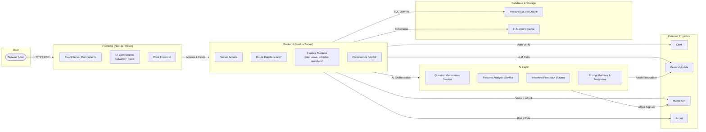
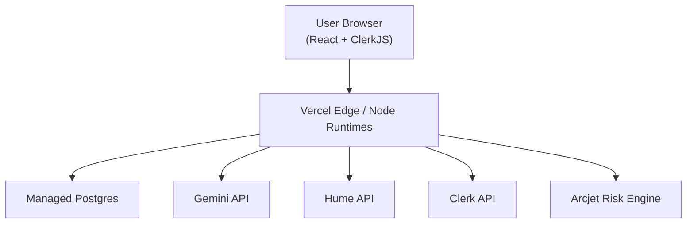
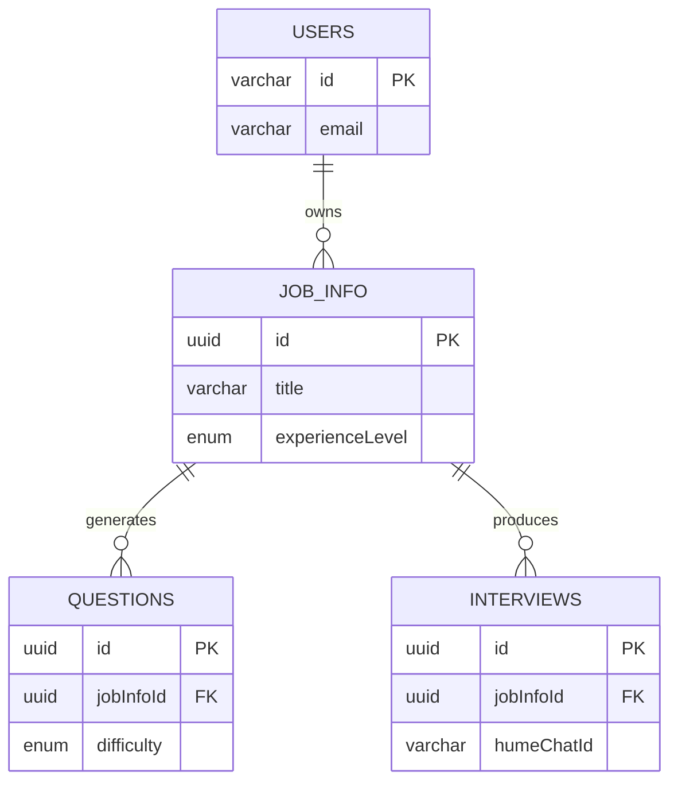
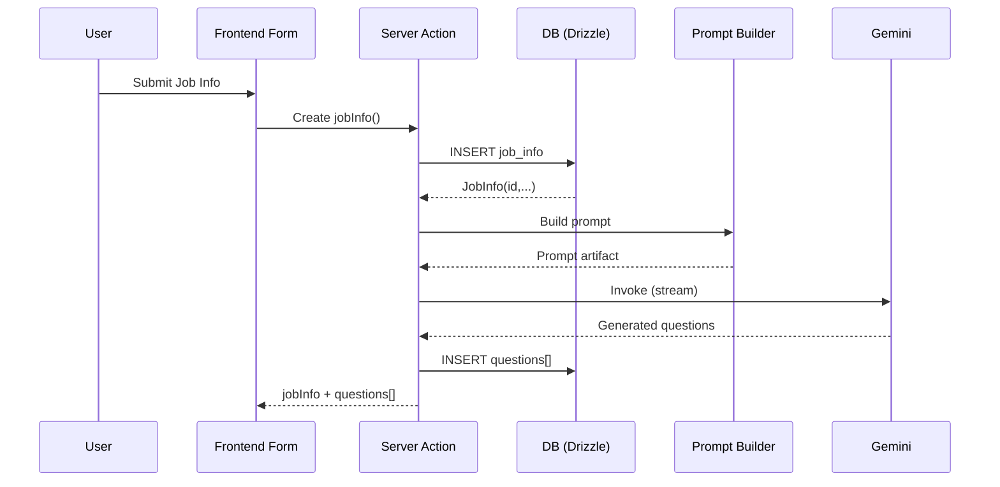
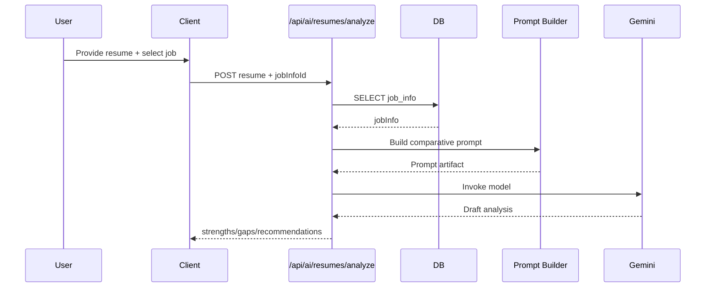

# System Architecture Diagrams

This document presents visual architecture representations of the AI Powered Job Prep platform using **Mermaid** (GitHub native rendering). It mirrors the boxed style of the provided reference image (User → Frontend → Backend → Data/Storage → AI Layer + External Services) while remaining text-based and versionable.

---

## 1. High-Level System Landscape



---

## 2. Deployment / Runtime Topology



---

## 3. Data Model (Current Core)



---

## 4. AI Question Generation Flow



---

## 5. Resume Analysis Flow



---

## 6. Interview Session & Affective Feedback (Planned Extension)

```mermaid
flowchart LR
  Start[Start Interview] --> Create[Create Interview Record]
  Create --> Voice[Hume Voice Session]
  Voice --> Affect[Emotional Metrics Stream]
  Affect --> Transcript[(Transcript Tokens)]
  Transcript --> Fusion[Future: Signal + Text Fusion]
  Fusion --> PromptFB[Feedback Prompt]
  PromptFB --> LLM[Gemini / Fallback]
  LLM --> Feedback[Structured Coaching]
  Feedback --> Persist[(Store Feedback)]
```



---

## 7. AI Processing Pipeline (Standard Pattern)

```mermaid
flowchart LR
  Raw[Domain Input] --> Normalize[Validate + Sanitize]
  Normalize --> Template[Template Rendering]
  Template --> Invoke[Model Invocation]
  Invoke --> Parse[Parse / Validate Output]
  Parse --> Enhance[Enrichment (difficulty, dedupe)]
  Enhance --> Persist[Persist / Cache]
  Persist --> Return[Return / Stream]
  Invoke -. Fallback .-> Alt[Secondary Provider (future)]
  Parse -. Error .-> Recovery[Retry / Safe Output]
```

---

## 8. Planned Observability (Conceptual)

```mermaid
flowchart TB
  Calls[AI Calls] --> Trace[Tracing Layer (OTel)]
  Trace --> Metrics[Metrics (Latency, Tokens)]
  Trace --> Logs[Structured Logs]
  Logs --> Sink[(Log Drain)]
  Metrics --> Dashboard[Dashboards]
  Calls --> Audit[Prompt/Response Audit Store]
```

---

## 9. Legend / Conventions

- Rectangles: Logical components
- Rounded: External actors or ephemeral processes
- Cylinders: Persistent storage
- Dashed arrows: Planned / future pathways
- "Fallback" edges indicate resilience strategies

---

## 10. Exporting Diagrams as Images

If you need static images:

1. Use VS Code Mermaid preview extension or mermaid.live
2. Paste code → Export PNG/SVG
3. Store under `public/diagrams/` if you want to embed in docs or marketing pages.

Optional CLI (Node):

```
npm install -D @mermaid-js/mermaid-cli
mmdc -i docs/DIAGRAMS.md -o public/diagrams/architecture.png
```

(For large mixed files, copy individual code blocks into temporary `.mmd` files.)

---

## 11. Future Additions

- Add `ai_audit_log` & `resume_analysis` ER extensions
- Add sequence for multi-model fallback
- Add cost governance diagram (budgets → enforcement → analytics)

---

## 12. Change Log

- 2025-09-16: Initial diagram compendium added.
  ``
